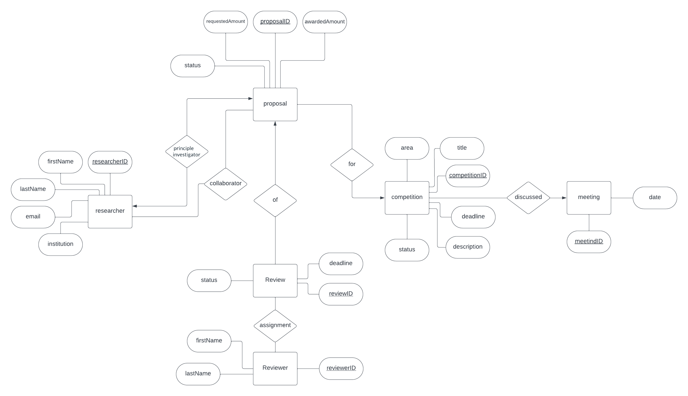

# Research Grant Council Database Specifications


## Objective
The primary objective of this database is to efficiently manage and store information related to grant competitions, submissions, reviewers, and the outcomes of these submissions for a research grant council. The database facilitates tracking grant proposals, review assignments, and the allocation of funds to researchers across various disciplines.

## Relations

### 1. Researchers

### 2. Grant Competitions (Calls for Proposals)

### 3. Grant Proposals

### 4. Reviewers

### 5. Review

### 6. Meetings

## Installation

This project requires Python 3.8 or later, Jupyter Notebook, and SQLite. Follow the steps below to set up the environment and run the project:

1. **Install Python:** Download and install Python from [python.org](https://www.python.org/). Ensure that Python and pip are added to your system's PATH.

2. **Install Jupyter Notebook:** Run the following command in your terminal or command prompt to install Jupyter Notebook:
   ```
   pip install notebook
   ```

3. **Clone the Repository:** Clone the project repository to your local machine using Git:
   ```
   git clone https://github.com/ahmad-masud/Research-Grant-Council-Database.git
   ```

4. **Navigate to the Project Directory:** Change into the project directory:
   ```
   cd Research-Grant-Council-Database
   ```

5. **Install Required Libraries:** Install the required Python libraries specified in the `requirements.txt` file:
   ```
   pip install -r requirements.txt
   ```

6. **Launch Jupyter Notebook:** Start Jupyter Notebook by running the following command in the project directory:
   ```
   jupyter notebook
   ```

7. **Open the Project Notebook:** In the Jupyter Notebook interface, navigate to the project notebook file (`.ipynb`) and open it to start working on the project.

Follow these steps to set up and run the project locally on your machine. Ensure that you have SQLite installed on your system, as it is used for the database component of this project. SQLite can be installed and configured following the instructions on the [SQLite official website](https://www.sqlite.org/).

## Acknowledgements
### - Ahmad Masud

### - Jaden Chan


